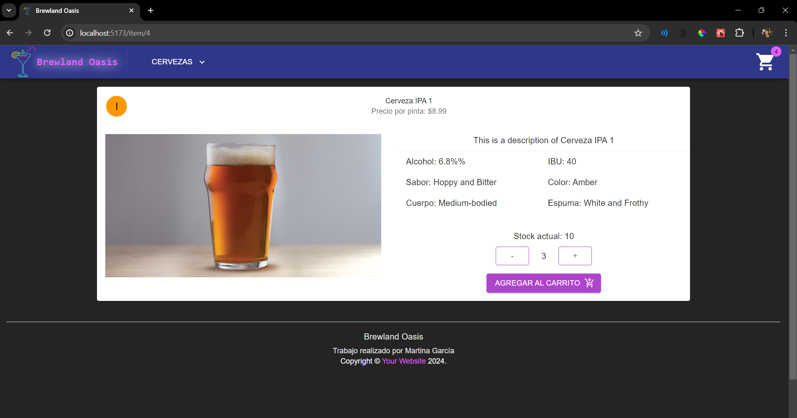

# Proyecto sitio web E-Commerce en React

## React + Vite

### Martina García

#### Coderhouse

---------------------------------------------
### Entregable 1: CreaTuLanding

Proyecto "CreaTuLanding" con componentes básicos de navegación por un sitio de e-commerce.
E-Commerce sobre venta de cervezas.

Visualización del proyecto:


### Entregable 2: NavegaLasRutas

Proyecto "NavegaLasRutas" con la incorporación de listado de productos, detalle de cada producto y navegación entre las distintas rutas.

Visualización del proyecto:




#### GIF: Navegacion por el sitio web


---------------------------------------------

# Para ejecutar este proyecto


1. Descargar o clonar el proyecto
2. En la carpeta raíz, ejecutar el siguiente comando para instalar las dependencias necesarias:

```
npm install
```

4. Para correr el proyecto en el puerto 5173 (puerto por defecto), ejecutar el comando:

```
npm run dev
```

5. Si todo salio bien, ingrese al [link de sitio web](http://localhost:5173/)
