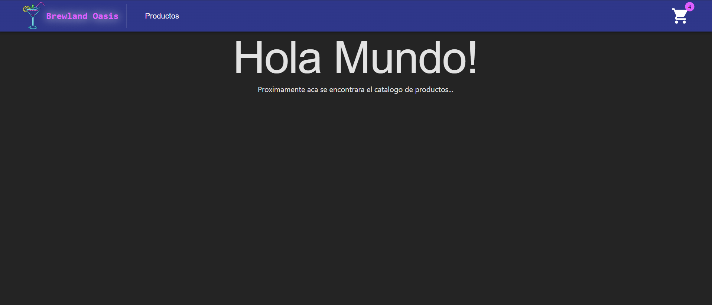

# React + Vite

Proyecto sitio web React: entregable 1
Curso React Coderhouse

Proyecto "CreaTuLanding" con componentes basicos de navegacion por un sitio de e-commerce.
E-Commerce sobre venta de cervezas, tragos y aperitivos.

Visualizacion del proyecto:


# Para ejecutar este proyecto

1. Descargar o clonar el proyecto
2. En la carpeta raiz, ejecutar el siguiente comando para instalar las dependencias necesarias:
```
npm install
```
4. Para correr el proyecto en el puerto 5173 (puerto por defecto), ejecutar el comando:
```
npm run dev
```
5. Si todo salio bien, ingrese al [link de sitio web](http://localhost:5173/)
